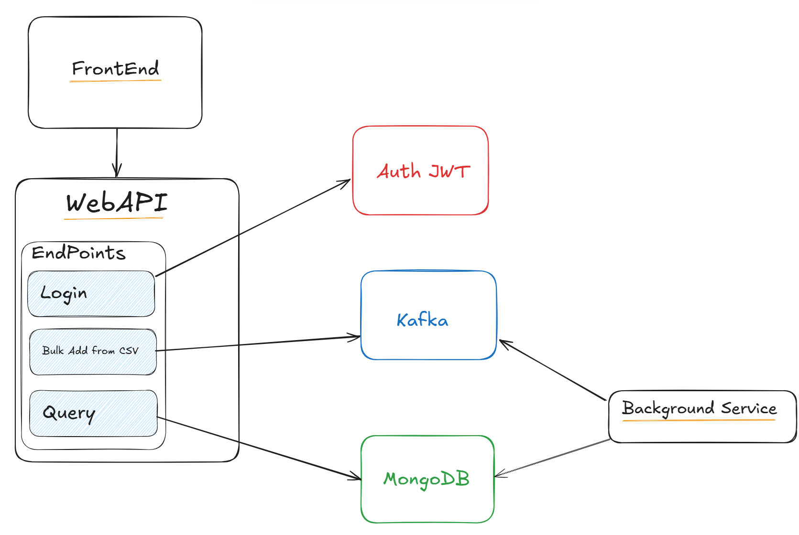
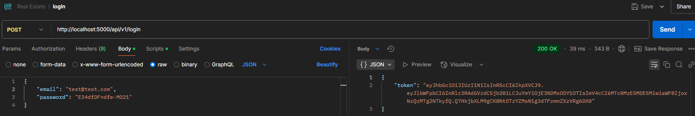
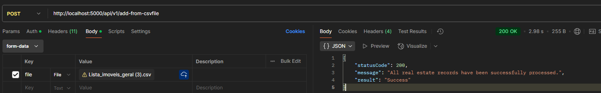
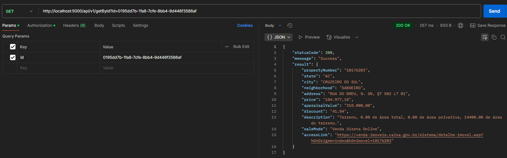
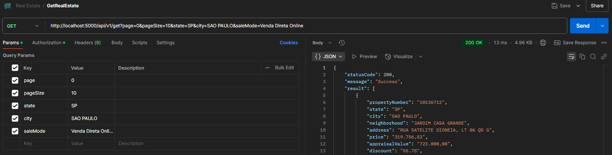
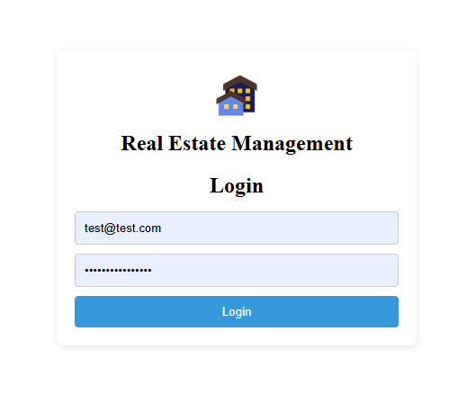
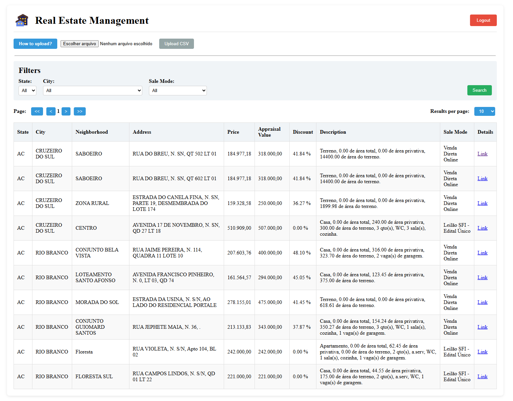

# Real Estate management

## Objective

It's a project to manage real estates, with features to bulk add from a CSV file and to query them with some filters available.


## How to run?

Requirements:
- You only need Docker installed and running on your computer, click [here](https://docs.docker.com/get-started/get-docker/) and follow the steps if you don't have it.
  
So, to run the application you only need to start the docker-compose present in the root folder, after that you will be able to access the project resources:

- Frontend -> [localhost:4200][frontend-url]
- WebApi -> [localhost:5000][api-url]
- Kafka -> [localhost:9000][kafka-url] 
- MongoDB -> [localhost:8081][mongodb-url]
  

## Architecture
The project's architecture follows the represented in the image below:



## Backend

#### WebApi

It's a .NET 9 WebApi, that uses [Kafka](#kafka) as a messaging service, and [MongoDB](#mongodb) as a non-SQL database to store the data.

After running the [docker-compose](#how-to-run) you can access it [here][api-url]

This API has four endpoints, to authenticate, store and request data:

- **/login ->**

    This endpoint is used to authenticate in the application, receiving an email and password in a JSON format, in the request body. This request returns a [JWT token](#jwt-token), to be used in the other requests of the api.

    The following email and password will authenticate successfully:

    ```json
    {
        "email": "test@test.com",
        "password": "E34dfDF*dfe-MO21"
    }
    ```

    Example of request/response:
    

- **/add-from-csvfile ->**
  
    Receives a CSV file, that is batch (batches of 1000) processed and messages with the content are sent to a [Kafka](#kafka) topic, to be later consumed by the [Background Service](#background-service).
    
    This request requires the [JWT token](#jwt-token) generated at the login request.
    
    
    The CSV file ([click here to get a sample](docs/csv-test-file.csv)) has to be separated by semicolons (;), and must have a header in this structure:


    **PropertyNumber;State;City;Neighborhood;Address;Price;AppraisalValue;Discount;Description;SaleMode;AccessLink**

    Example of request/response:
    
    

- **/getById ->**

    Finds a real estate by the Id and returns its content, this request requires the [JWT token](#jwt-token) generated at the login request.

    Example of request/response:
    

- **/get ->**

    Queries real estates, with the following filters (page, pageSize, state, city and saleMode) and returns its content, this request requires the [JWT token](#jwt-token) generated at the login request.

    Example of request/response:
    

#### Background Service
It's a .NET 9 Background Service, that consumes messages from a [Kafka](#kafka) topic, and stores the real estates received at [MongoDB](#mongodb).

## Frontend
The frontend is built with Angular, and it has only 2 pages:
- Login page (You can login with the credentials provided at [login](#webapi) request)
  
  

- Dashboard page, where you can upload the CSV file, and also query the content
  
  

After running the [docker-compose](#how-to-run) you can access it [here][frontend-url].

## Resources utilized by the project

### Kafka
Kafka is a messaging service used to receive and propagate messages to consumers.

After running the [docker-compose](#how-to-run) you can click [here][kafka-url] to access an interface and check on messages sent.

Topic: RealEstate-Register

### MongoDb
MongoDB is a non-SQL database, in this project's context its used to store Users and Real Estates data.

After running the [docker-compose](#how-to-run) you can click [here][mongodb-url] to access mongo-express and manage the database.

**Default credentials: user:** admin | **password:** password

**Database:** real-estate

**Collections:** User, RealEstate

### JWT Token
JWT (JSON Web Token) is an open standard (RFC 7519) for securely transmitting information between parties as a JSON object.

After receiving the JWT from the [login](#webapi) request, you'll need to include it in the header of the subsequent HTTP requests.

Example:

```bash
curl --location 'http://localhost:5000/api/v1/getById?id=0195dd7b-1fa8-7cfe-8bb4-9d446f3586af' \
--header 'Authorization: Bearer TOKEN'
```


[api-url]: http://localhost:5000/
[frontend-url]: http://localhost:4200/
[mongodb-url]: http://localhost:8081/
[kafka-url]: http://localhost:9000/